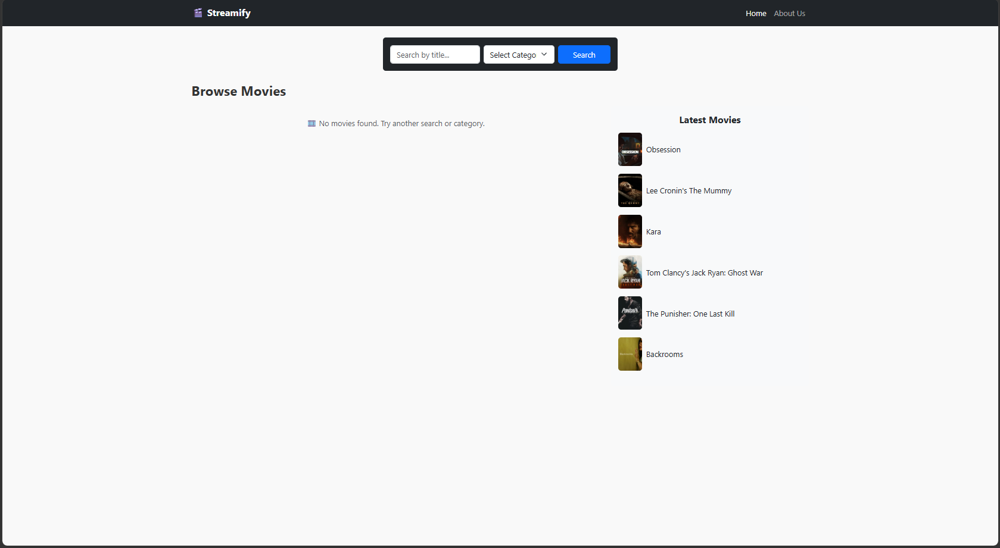
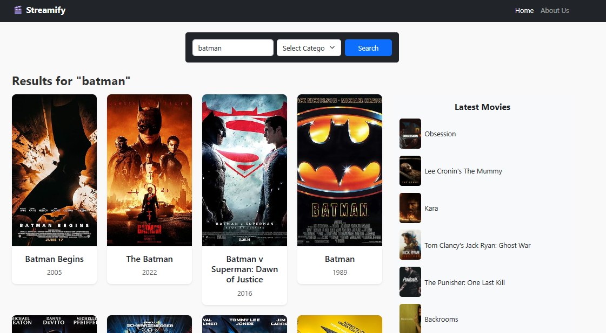
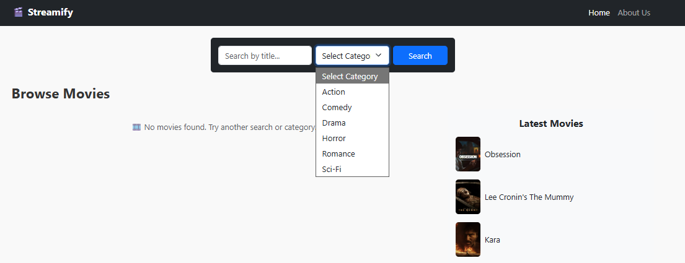
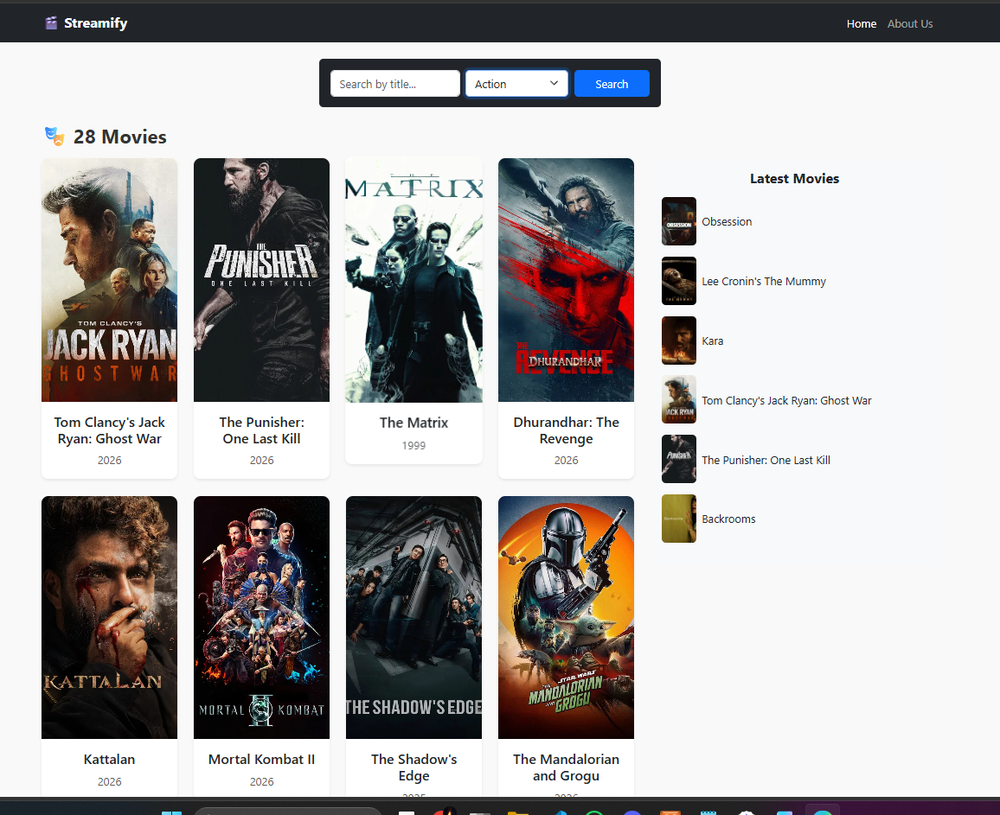

# Streamify

Streamify is a React-based movie discovery application that allows users to search for movies, browse content by category, and view currently available movie information using external movie APIs.

## Project Overview

The application was developed to demonstrate practical knowledge of React development, API integration, routing, reusable components, and responsive user interface design.

## Features

* Search for movies by title
* Browse movies by selected categories
* View movie information from external APIs
* Navigate between pages using React Router
* Responsive layout using React Bootstrap

## Screenshots

### Start Page



### Search Results



### Categories



### Action Category



## Technologies Used

* React
* React Router
* React Bootstrap
* Axios
* OMDb API
* TMDb API

## Installation and Setup

To run the project locally:

```bash
npm install
npm start
```

## Purpose

This project was created as part of my learning and portfolio development to strengthen my skills in front-end development, working with APIs, and building interactive web applications.
